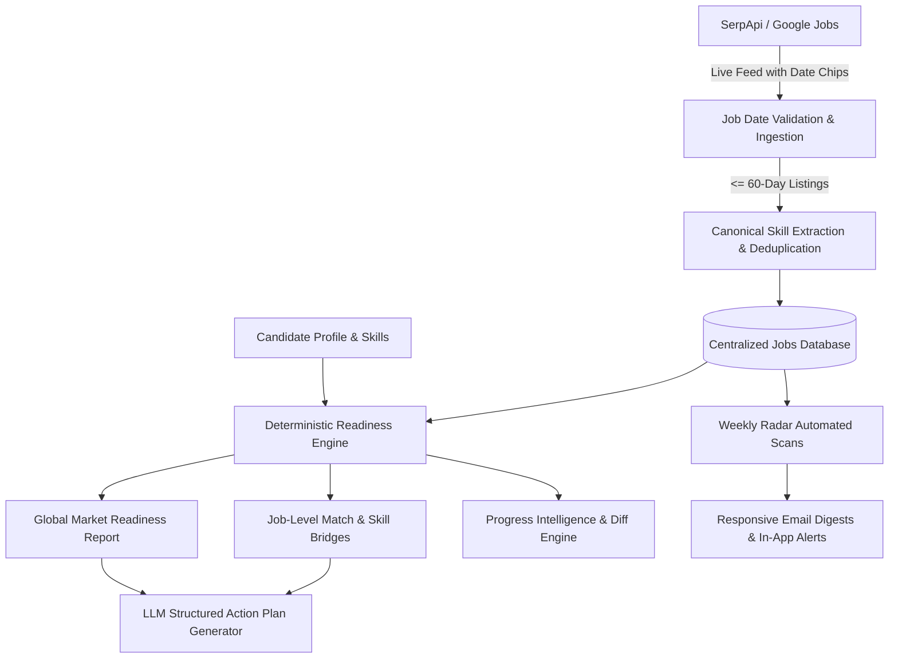

<div align="center">

# 🎯 CAREERRADAR
### Continuous Developer Market-Readiness Intelligence Platform

[](https://nextjs.org/)
[](https://fastapi.tiangolo.com/)
[](https://www.typescriptlang.org/)
[](https://www.python.org/)
[](https://www.postgresql.org/)
[](https://tailwindcss.com/)
[](https://opensource.org/licenses/MIT)
[](https://github.com/daxp472/careeer-radar)

<p align="center">
  <strong>Turn live technology job market requirements into actionable, mathematically grounded developer readiness signals.</strong>
</p>

[Key Features](#-core-features) • [Architecture](#-system-architecture) • [UI/UX Design System](#-uiux-design-system) • [Quickstart](#-quickstart-guide) • [API Reference](#-api-endpoints) • [Testing](#-testing--production-hardening)

</div>

---

## 💡 What is CareerRadar?

**CareerRadar** is NOT a conventional job board or a basic resume builder.

It is a **market-readiness intelligence engine** built for early-career developers, students, and self-taught software engineers. CareerRadar continuously monitors the live tech job market via **SerpApi (Google Jobs)**, analyzes high-frequency employer skill requirements, compares them against a candidate's actual proficiencies, calculates deterministic match & gap scores, and provides structured AI-guided roadmaps to close high-priority gaps.

---

## 🌟 Core Features

### 1. 🔍 Live Market Search & Ingestion
- Real-time Google Jobs search powered by SerpApi with automatic query normalization.
- **60-Day Recency Filter & Date Cache**: Enforces strict date validation rejecting stale job postings from 2–3 years ago.
- Automatic deduplication across job boards, locations, and employer listings.

### 2. 📊 Deterministic Readiness Engine
- **Transparent Mathematical Scoring**: Market readiness scores (0–100%) are calculated deterministically based on skill market frequencies and candidate proficiencies.
- **Canonical Skill Taxonomy & Alias Resolution**: Automatically resolves aliases like `React.js` → `React` and `Postgres` → `PostgreSQL`.
- **Skill Classification**: Flags market requirements into **Matched**, **Weak**, or **Missing** categories.

### 3. 💼 Job-Level Match & Gap Breakdown
- Detailed required vs. preferred skill weighting per job posting.
- **Targeted Skill Bridges**: Generates concrete next steps for every missing job requirement.

### 4. 🗄️ Central Job Database & Candidate Watchlist
- Central database browser with real-time candidate match scoring.
- Save opportunities to a personalized watchlist with dynamic score recalculation as candidate skills improve.

### 5. ⏰ Automated Weekly Radar Scans & Email Alerts
- Timezone-aware weekly job scans (`candidate_scan_service.py`).
- Automated in-app notifications and responsive HTML email digests matching the candidate's target threshold.

### 6. 📈 Progress Intelligence ("What Changed?")
- Historical career growth trajectory tracking readiness over time.
- **Analysis Diff Engine**: Compares readiness across scans, calculating score velocity, newly acquired skills, and resolved skill gaps.

---

## 🏗️ System Architecture



---

## 🎨 UI/UX Design System

CareerRadar features a custom, accessible dark-mode interface built on CSS variable tokens:

- **Tokenized Color System**: Slate, cyan, indigo, emerald, amber, and rose semantic accents.
- **Interactive Visualizations**:
  - `ReadinessRing`: SVG radial progress indicator with animated gradients.
  - `SkillChip`: Categorical skill badges with proficiency status indicators.
  - `EmptyState`: Actionable fallback displays with illustrations and quick actions.
  - `Skeleton`: Responsive shimmer placeholders during loading states.
- **Accessibility & SEO**: Semantic HTML5 hierarchy, full OpenGraph/Twitter cards on all 11 routes, and `prefers-reduced-motion` compliance.

---

## 🚀 Quickstart Guide

### Prerequisites
- **Node.js**: v20+
- **Python**: v3.11+
- **PostgreSQL**: v15+ (or SQLite for local dev)
- **SerpApi API Key** & **Google Gemini API Key**

### 1. Repository Setup
```bash
git clone https://github.com/daxp472/careeer-radar.git
cd careeer-radar
```

### 2. Backend Setup
```bash
cd backend
python -m venv venv

# Windows
.\venv\Scripts\activate
# macOS/Linux
source venv/bin/activate

pip install -r requirements.txt
cp ../.env.example .env
uvicorn app.main:app --reload --port 8000
```

### 3. Frontend Setup
```bash
cd ../frontend
npm install
npm run dev
```

Visit `http://localhost:3000` to access the web application.  
API documentation is available at `http://localhost:8000/docs`.

---

## 📡 API Endpoints

| Method | Endpoint | Description |
|---|---|---|
| `POST` | `/api/v1/auth/register` | Register candidate account |
| `POST` | `/api/v1/auth/login` | Authenticate and obtain JWT token |
| `GET` | `/api/v1/profile` | Get candidate profile and skills |
| `POST` | `/api/v1/analyses` | Trigger live market readiness analysis |
| `GET` | `/api/v1/analyses/{id}` | Get market analysis breakdown |
| `GET` | `/api/v1/analyses/{id}/diff` | What changed compared to previous analysis |
| `GET` | `/api/v1/analyses/{id}/feedback` | Personalized qualitative feedback |
| `GET` | `/api/v1/jobs/search` | Search central database with match scores |
| `GET` | `/api/v1/jobs/{id}/analysis` | Job-level skill gap breakdown |
| `POST` | `/api/v1/watchlist/{job_id}` | Save job to candidate watchlist |
| `POST` | `/api/v1/automation/scan-now` | Trigger immediate candidate radar scan |
| `GET` | `/api/v1/notifications` | Get candidate notifications |

---

## 🛡️ Security & Production Hardening

- **Sliding-Window Rate Limiting**: Multi-tier rate limiting against brute force and scraping.
- **OWASP Compliance**: Secure HTTP headers (`nosniff`, `DENY`, `HSTS`, strict `Referrer-Policy`).
- **Deterministic Separation**: LLM never mutates quantitative match scores or ranking weights.

---

## 🧪 Testing & Production Hardening

Run the comprehensive 23-suite backend test suite:
```bash
cd backend
pytest -v
```

Verify the frontend production build:
```bash
cd frontend
npm run build
```

---

## 📄 License

This project is licensed under the [MIT License](LICENSE).
